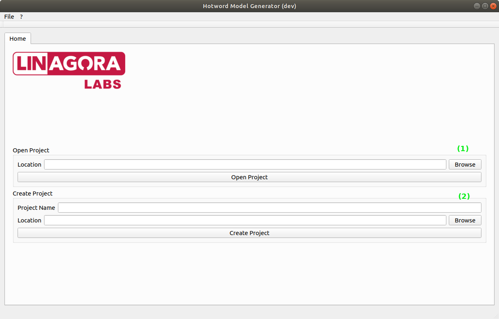
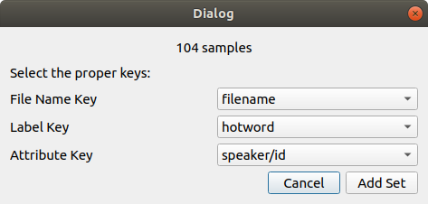

## Custom hotword
You want to use your own wake-word to call your device with a sweet or business-related name ? You are at the right place.

What make a good wake-word ?
* **Not too short, not too long**. "LinTO" is on the short side. It is good to have 2-4 syllabes.
* Not a common name. Using a common name expose you to risk of the system being randomly triggered.
* There is some phoneme that are very disctinctivly identifiable such as [t, k, p, th].

We published a tool that will help create your own keyword spotting model.

## Prerequisites

### HMG
You need first to download the [howtord-model-generator](https://github.com/linto-ai/hmg) tool.

### Data 
In order to train your wake-word, you'll need to **gather some samples** first.

You'll need 2 kinds of audio samples:
* A bunch of recording of the word you want to use.
* A bunch of recording of random speech/noise audio where the word is not pronounce.

How many is a bunch ? There is no limit, the more sample you have with the more different voices, background noises, prononciations you can have, the more the trained model will be robust to new locutor and new context. The only limitation is to have approximatively a ratio of 1% wake-word for 99% non-wake-word.

## Prepare the data

Once you have your data you will need to prepare them. The preparation step is to ensure that all the recording have the same shape: duration, sampling_rate, number of channel, encoding.

[To be redacted]

## Build your model

Once you have your samples ready to go, it's time to use hotword-model-generator.

### 1 - Create a new project
First of all, launch ```HMG```.

On the main page, you can load an existing project (1) or create a new project (2).



You can either set your project name or directly click on create to display the create project window.


Set your project name and the project location and specify the keyword(s) you'll be training. It might be a single keyword or multiple keywords.

Once the information are set, click on create. A folder containing a single project_name.proj is created. It is a json file containing all the project parameters.

### 2. Setting the data
Once the project is created, a new tab is available: Prepare.

This tab allow your to specify the data you'll use to train the model.

There are two ways adding data:
* Using a json file describing the data
* Selecting a folder containing the samples

#### json file
By selecting a json file (2) a prompt will ask you to select the field used to describe the samples:



- ```File name``` is the field containing the ... file's name
- ```Label``` is the field containing the keyword's name. Note that the name must be the same as the one set at the first step.
- ```Attribute``` is the characteristic your want to use to split the samples between the different sets (training, validation, test). For instance the speaker.

#### Adding sample from folder
To add sample from a folder (1), first select which keyword or non-keyword the folder contains using the comboBox at the far right, then click add from folder.
The folder must contain only one kind of sample. 

#### Buildings sets
By using the selector (3) set the percentages of sample you want to use to split the sets.

You can choose to split the samples using the attributes (if there is any). In that case they will be split so that samples in the different sets have different attributed. For example, if the attributes are the speaker's id, speakers in the training set will be different than the ones in the other 2 sets.

Once satisfied, click on done.

### 3. Setting the features.
The next panel allows you tune the audio features use on the samples.


In ```Sample Parameters``` you can specify the sample length (in second).

```Preprocessing``` allows you to use pre-emphasis on the sample to amplify the high frequencies.

```Window Parameters``` specifies the features extraction steps. Here, features are extracted on 64ms window every 32ms on 1s samples (Sample length) giving an input vector of size 30.

```Features```. For now, only MFCC features are implemented. You can tune feature parameters and visualize what the mean net input will looks like by clicking on analyse samples.

Once finished, click on ```Setup Features Parameters``` to go to the training step.

### 4. Model setup and training.
This tab allow you to tune the net and training parameters.


In ```Model parameters``` you can change some of the net parameters such as Dropout, Loss function, Number of dense Layer and Layer's sizes or add a Gaussian noise layer.

``` Training parameters ``` allows you to set the number of epoch, batch size and set some flags.

Once satisfied click on ```Train``` to begin training. 

The training might take some time as it need to extract all the features from the samples first. You can visualize in real time the progression of the training and stop it at any time.

Once the training is complete or stopped the next tabs become available.

If you are not satisfied you can click on ```Delete Model``` and start the training over with new parameters.

### 5. Evaluate your model
The Evaluate tab run the trained net on the training set and displays metrics.


Wrongly classified samples are available to listen on the bottom panel. It allows you to spot bad apples in your sets. 

### 6. Test your model
The test tab allow to run your model and try it using your microphone


Click on test to start the real time inference. The chart display the result for each hotword. If the threshold is reached the sample is added to ```recorded activations``` output.

### 7. Export your model

Once you are satisfied you can export your model using the export tab. 


For now, only the tensorflow protobuf (.pb) is available. Select the model version and click on ```Tensorflow format```. Your model will be saved in *PROJECT_FOLDER*/output/*MODEL_NAME*/*VERSION*/.

To export the parameters file click on ```Generate Manifest``` then select the destination. The *.param* file created contains the audio, feature and model parameters. 

## Use your trained model
To use your newly created model, you need to copy the content of the output folder on the device with the .param file beside the .pb.

Then you must specify it to the command-module either by editing the .env file or by passing it through an environement variable.

There you are ! You custom wake-word is now running.