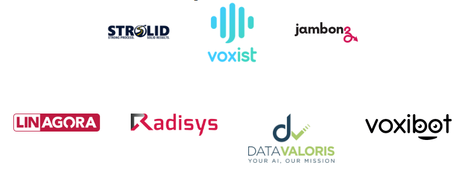

Chers hackers, [LINAGORA](https://www.linagora.com) et [Le Voice Lab](http://www.levoicelab.org/) auront le plaisir de vous acceuillir dans **les locaux LINAGORA de la Défense** pour cette édition 2022 du [TADHACK France](https://tadhack.com/2022/global/tadhack-global-france/)

:::tip Rendez-vous les 15-16 octobre 2022
```
Bureaux de Linagora
100, terrasse Boieldieu, 92042
PARIS LA DEFENSE CEDEX
```
:::

:::tip Venez échanger avec les autres participants, formez vos équipes et échangez dès maintenant avec les **apporteurs de technologies** du hackathon
Rejoignez le serveur Discord dédié en utilisant [ce lien : https://discord.gg/ZFKUThJnjs](https://discord.gg/ZFKUThJnjs)
:::




## Découvrez LinTO

La **plus grande base de code de technologies vocales Open Source du monde** pour **développer votre innovation**.

<iframe width="560" height="315" src="https://www.youtube.com/embed/AmeaZXFtsLY" title="YouTube video player" frameborder="0" allow="accelerometer; autoplay; clipboard-write; encrypted-media; gyroscope; picture-in-picture" allowfullscreen></iframe>

## Resources à disposition pour le TADHACK 2022

- Un support et un accompagnement pour la découverte et l'utilisation de nos technologies et de notre [documentation](/docs/developpers)

- Une plateforme LinTO Serveur **déja en place** pour **déployer immédiatement** des **agents vocaux intelligents** directement dans des pages / application web. Nous souhaitons ainsi vous permettre de **vous concentrer sur la valeur de votre proposition** sans de fastidieuses tâches d'administration serveur.

- Un accès complet aux **Cognitives APIs** de LinTO pour traiter facilement de fichiers ou de streaming


[Live Demo : l'agent vocal LinTO dans une page web](https://linagora.com/fr/produits/linto/) 


### Cognitive APIs

Une collection d'APIs proposées de manière pratique sous forme d'images Docker prêtes à l'emploi. Ces images Docker peuvent être exécutées de manière autonome pour le développement et les tests avec des points d'accès HTTP et WS intégrés.

Nos API, qui **gèrent des requêtes HTTP synchrones**, peuvent également être invoquées par le biais d'un **task-broker basé sur Celery** pour le mode asynchrone/tasks. Cette fonctionnalité vous permet de développer vos propres services hautement disponibles.

- Reconnaissance automatique de la parole (transcription de fichiers multimédias et streaming)
- Text To Speech (synthèse vocale)
- Compréhension du langage naturel
- Ponctuation automatique des textes
- Diarisation et identification du locuteur

[Documentation dédiée](/docs/developpers/apis)


### Virtual agents & Smart Assistants - In the browser

Solution complète de bout-en-bout pour concevoir et opérer des **assistants intelligents (assistants vocaux)** et des agents d'intelligence conversationnelle (type chatbots, callbots...). **Alternative complète** aux outils dédiés aux développeurs d’applications d'intelligence conversationnelle, tels que **DialogFlow de Google, Azure Bot de Microsoft ou encore IBM Watson**.

- Chatbots / Voicebots avec mot réveil personnalisé **sur une page Web**
- Compréhension du langage naturel (NLU) et ASR (Automatic Speech Recognition)
- Framework de développement de compétences et d'actions (Dialogflow / IBM Watson Alternative)
- Smart Speaker Engine / moteur d'assistant intelligent
- Gestion de flotte de terminaux vocaux (numéros de série / identifiants)
- Gestion des installations en utilisant le contrôle vocal dans votre bureau / à la maison
- Accès vocal aux applications ou pages Web de vos clients finaux.
- **Mots réveil 100% logiciel** (Alexa, Ok Google...)
- Clients Android et ARM (Raspberry Pi)

[Documentation dédiée](/docs/developpers/agent)

### LinTO Smart Meetings

Ce sujet combine et exploite notre outil Smart Assistants et nos API cognitives. **Nos API ont été initialement développées pour des solutions collaboratives impliquant de nombreux utilisateurs et intervenants**. Sur la base de cette forte expertise du domaine, nous avons décidé de pousser l'innovation plus loin avec notre propre plateforme open source de Scribe Virtuel (LinTO Conversation Manager). Déployée sur infrastructures propres, les utilisateurs peuvent télécharger leurs réunions, enregistrements, vidéoconférences Jitsi avec sous-titres LinTO... les partager, les annoter, les corriger et exploiter facilement leur contenu à l'aide d'une extraction intelligente de l'information.

- Sous-titrage en direct pour visioconférence (Jitsi)
- Transcription multilocuteurs, annotation, extraction d'informations significatives...
- Open Source Virtual-Scribe : Gestionnaire de conversation LinTO

[Documentation dédiée](/docs/developpers/meeting)